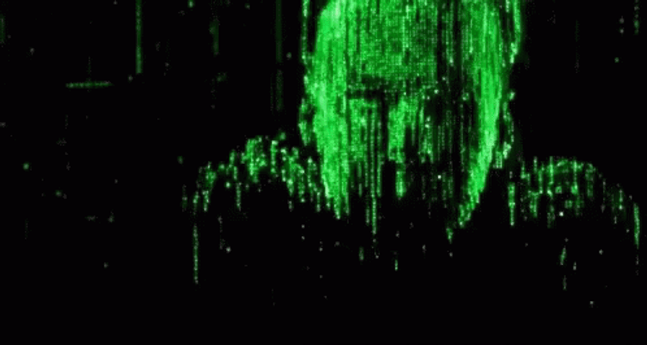

## ___@luizedua___ 

## **Hey There!**

>___Welcome to my github page. I'm Luiz Eduardo, I'm 22yo and a cadet @42SP___

>___I'll be uploading my progress troughout the cursus here.___

>___For further informations you can contact me trough my socials.___

LinkTree
#
## SKILLS & STATS 

# CURSUS TRAIL

  

# ENTRANDO EM ÓRBITA (LV.1) (ok)

 
 
 

# AMPLIANDO HORIZONTES (LV.2) (in progress)

<a href="https://github.com/luizedua42/42_push_swap" target="_blank">
<a href="https://github.com/luizedua42/42_minishell" target="_blank">

#

  

